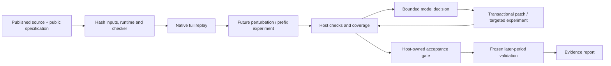

# Workflow architecture (0.4)

## One implementation

`workflow.py` owns baseline, diagnosis, experiments, edits, submission and holdout execution. The `btr` CLI, corpus runner and old `external_agent.py` / `external_eval.py` facades call this same implementation. The old independent agent loop and ToolBox submission path were removed. The historical B1/B2/B3 statistical experiment is not the current production API.

`validation.py` owns native caching, accounting, causality, observer conformance and protected-indicator comparisons. `rules.py` owns coverage and public strategy invariants. `acceptance.py` checks the exact submitted source hash and all mandatory checks; model text cannot override them.

## Durable execution and cost accounting

An execution directory is `OUTPUT/task_id/SHA256/`. The SHA covers declared public files, bars, warmup/releases, specification, runtime image/interpreter, timeout, execution mode, complete checker package and policy. Remote authentication fields are excluded. Public strategy identifiers cannot escape the output directory. Changed inputs produce a distinct execution identity; existing evidence remains intact.

Native result receipts are cached by the same full input identity plus experiment options. Successful and failed executions are retained. Automatic identical reruns are disabled. Each native attempt has its own request, trace and result; failures consume the episode run allowance.

An OS file lock prevents two processes from running the same episode. JSON checkpoints use write/fsync/atomic replace. Model calls write request and dispatch receipts before network I/O, then persist the returned response before applying actions. Resuming can reuse a returned response and completed tool actions. Edits journal both source hashes and replacement contents, so a crash cannot apply a replacement twice. A dispatched call with no durable response is **usage unknown** and is never automatically rebilled. Provider tokens are recorded; currency costs are unknown when the relay does not report prices.

## Evidence and counterexamples

The initial diagnostic changes only bars strictly after a visible cutoff, preserves history and native end time, then compares observations through the cutoff itself. Modified future candles are explicitly diagnostic transformations of historical data. They are not additional real market samples. The model can request a prefix experiment or a different cutoff with a stated hypothesis. Every requested experiment enters the mandatory validation plan. A later patch is checked against all those cutoffs; a default passing probe cannot erase another failed/inconclusive experiment, and old-source evidence cannot validate a new candidate. `localize` tries two earlier cutoffs without discarding required history; it does not claim global counterexample minimality.

End-of-run forced exits are excluded only when explicitly identified; signals and indicators at the boundary remain checked. Missing observations or unexercised required paths are inconclusive. A full native ledger reconciles fees, account observations and fills. Freqtrade's observed ROI/stop/exit configuration must match the public specification.

AST checks freeze imports, parameters, inheritance, unrelated methods and trading comparison predicates. Protected indicator observations are compared with the immutable original run, rather than letting edited code define its own expected signal. Allowed defective indicator columns are explicit exceptions. WTC additionally protects the original WaveTrend/STOCH calculation statements while permitting the declared normalization repair.

## Information boundary

Only the public candidate source, specification and declared fixtures go into workers. Only visible summaries/source and tool replies go into model prompts. Original fixed upstream versions, PR labels and later-period fixtures are never supplied to the agent. A holdout is strictly later than the visible interval, uses the frozen submitted source, and cannot feed back into that episode.

Workers use non-root Linux containers, no network, read-only root, no capabilities, resource limits and scratch tmpfs. Inputs are hash-checked before and after execution. The host accepts one bounded compressed response with the expected request identifier, framework version and result schema. SSH reads are bounded and cleanup runs after transport errors as well as timeouts.

These controls limit host access and accidental evidence corruption. The recorder and strategy share a Python interpreter: a deliberately hostile strategy with introspection can attack the recorder. Request identifiers are framing, not cryptographic proof of an untampered computation. Fully adversarial verification would require an independent trusted observation boundary.

## Supported scope

| Engine | Interface | Exercised profile |
|---|---|---|
| Backtrader 1.9.78.123 | Strategy / SignalStrategy, optional native Sizer | Single daily instrument, native orders, proportional fees |
| backtesting.py 0.6.6 | Strategy / composable SignalStrategy and TrailingStrategy | Daily bars, native stop/limit orders, cash-equivalent ledger |
| vn.py CTA 1.4.1 | CtaTemplate callbacks | Minute/daily linear futures, native warmup, window bars, limit/stop orders |
| RQAlpha 6.4.0 | init / handle_bar module | Single daily A-share, native lot rounding/T+1/current-close fills |
| Freqtrade 2026.8 | IStrategy | Single spot pair, 5m/30m/1h/daily, ROI/stop/signal exits |

This is not complete support for every feature of these frameworks. Tick data, multiple assets, live orders, liquidation/funding, corporate actions and arbitrary scripts are outside the profiles. Freqtrade custom execution callbacks, shorts and position adjustment are rejected. RQAlpha fixture metadata does not model exchange price limits or volume limits. Original examples' sizing/risk logic is preserved, but supplied instruments, costs and testing intervals are benchmark choices, documented in each specification.
